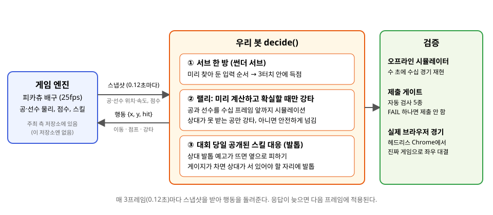

# 리온이 배구 AI 봇 — 2026 SKKU × HYU CSE 교류전 AI 부문 우승

성균관대학교와 한양대학교 소프트웨어학과가 함께 연 교류전의 AI 부문에서, 팀 **사자먹는은행** 이 만든 배구 게임 봇입니다. 대회 당일 처음 공개된 숨은 스킬까지 한 시간 안에 대응해 **우승**했습니다.

> **English.** Winning bot of the 2026 SKKU × HYU CSE AI volleyball competition. Two bots play a 2-player volleyball game (a modified Pikachu Volleyball); every 0.12 s each bot sees the ball and players and answers with move / jump / smash. Ours wins with (1) a pre-computed serve that scores directly, (2) a rally engine that simulates the physics ahead and only smashes when the opponent provably cannot reach, and (3) a layer written on the day of the event for the hidden "claw" skill. Everything was checked with an offline frame-exact simulator, an automated submission gate and real headless-Chrome matches. The game engine is not included here — see *직접 돌려보기*.



## 어떤 대회인가요?

- 게임은 **피카츄 배구**(1997년 PC 게임)를 웹으로 옮긴 것을 주최 측이 대회용으로 고친 것입니다. 두 선수가 네트를 사이에 두고 공을 넘기고, 공이 자기 코트 바닥에 떨어지면 실점합니다. 10점을 먼저 내면 이기고, 4분이 지나면 앞선 쪽이 이깁니다.
- 참가자는 선수를 조종하는 **봇**(자바스크립트 함수 하나)을 제출합니다. 게임은 0.12초마다 "지금 공과 두 선수가 어디에 있고 얼마나 빠른가"(스냅샷)를 봇에게 주고, 봇은 "왼쪽/오른쪽으로 갈지, 점프할지, 강타할지"만 돌려줍니다. 사람이 키보드로 하는 것과 똑같은 입력입니다.
- 한 쪽이 공을 5번 넘게 만지면 실점하고, 응답이 늦으면 그 틱은 가만히 서 있게 됩니다.
- **대회 당일에 숨은 스킬이 공개**됐습니다. "발톱": 게이지가 차면 상대가 있는 자리를 노려 쓰고, 1초 뒤 그 자리에 있으면 1.8초 동안 움직이지 못합니다. 봇은 공개된 규칙 코드를 읽고 그날 안에 대응해야 했습니다.

## 우리 봇은 어떻게 이기나요?

세 가지 아이디어입니다. 자세한 설계는 `bot/Lion_Eating_Bank_v12.md` 에, 코드는 `bot/` 에 있습니다.

1. **서브 한 방.** 내 서브 공이 떨어지는 타이밍은 세 가지뿐이라는 것을 알아내고, 각 타이밍마다 "이 순서로 입력하면 3터치 만에 상대 코트에 꽂힌다"는 입력 순서를 미리 찾아 뒀습니다. 서브 때는 그 순서를 그대로 재생합니다. 도중에 공이 예상과 어긋나면 즉시 보통 방식으로 돌아갑니다.
2. **미리 계산하고, 확실할 때만 강타.** 게임의 물리 규칙(공의 포물선, 선수의 점프 높이, 충돌 시 공이 튀는 방향)을 봇 안에 그대로 옮겨 놓고, 스냅샷을 받을 때마다 수십 프레임 앞을 시뮬레이션합니다. 후보 행동마다 "이렇게 치면 공이 어디에 떨어지고, 상대가 걷기·점프·다이빙 어느 것으로도 닿을 수 있는가"를 계산해서, **상대가 절대 못 받는 공만 강타**하고 아니면 안전하게 넘깁니다. 수비할 때는 상대가 어디로 칠 수 있는지 범위를 계산해 가장 적게 움직여도 되는 자리에 섭니다.
3. **당일 스킬 대응.** 공개된 규칙 코드를 읽고 두 가지를 얹었습니다. 상대의 발톱 예고가 보이면 옆으로 피하고(단, 공이 먼저 오면 공을 칩니다), 내 게이지가 차면 "상대가 공을 받으려면 서 있어야 할 자리"에 발톱을 씁니다. 피하면 공을 놓치고, 받으면 발톱에 맞는 구조입니다.

봇의 나머지는 이 셋을 상황에 맞게 고르는 관리 코드와, 어떤 예외가 나도 유효한 행동을 돌려주는 안전장치입니다.

## 어떻게 믿을 수 있나요?

봇을 고칠 때마다 눈으로 경기를 보며 확인할 수는 없어서, 검증 도구에 먼저 시간을 썼습니다. 전부 `tools/` 에 있습니다.

| 도구 | 하는 일 | 왜 필요한가 |
|---|---|---|
| 오프라인 시뮬레이터 (`sim_real.mjs`) | 주최 측 엔진 코드를 그대로 불러와 실제 경기 진행(서브, 준비 시간, 5터치 제한, 입력 지연)을 프레임 단위로 똑같이 재현 | 브라우저 없이 수 초에 수십 경기. 시드를 고정하면 같은 경기가 재현돼 수정 전후를 정확히 비교 |
| 출력 동일 검사 (`shadow_diff.mjs`) | 두 봇에게 똑같은 상황을 주고 한 틱이라도 다른 행동을 하는지 검사 | 코드를 정리하거나 스킬 층을 얹을 때 "원래 동작이 안 바뀌었다"를 증명 |
| 규칙 검사 (`rule_check.mjs`) | 파일 크기, 금지된 API, 응답 시간, 잘못된 반환값, 삼켜진 예외를 실제 경기를 돌리며 검사 | 대회 규칙 위반과 시간 초과를 제출 전에 걸러냄 |
| 제출 게이트 (`gates.mjs`) | 위 검사를 한 번에 실행. 하나라도 FAIL 이면 제출하지 않는다는 팀 규칙 | 대회 당일 급하게 고친 봇을 감으로 올리지 않기 위해 |
| 실제 브라우저 경기 (`harness_dayof.mjs`) | 주최 측 게임을 빌드해 헤드리스 Chrome 에서 진짜 게임으로 좌우 한 경기씩 돌리고 콘솔 로그를 요약 | 시뮬레이터가 놓칠 수 있는 실제 환경(Worker, 타이밍)을 확인 |
| 스킬 재현 (`skills/claw_real.mjs`) | 당일 공개된 스킬 코드를 시뮬레이터에 그대로 붙여 스킬 켬/끔, 설정별 대결 | 스킬 대응이 실제로 이득인지 숫자로 확인 |

대회 전날 받은 외부 리뷰가 봇의 물리 예측 오류 3개와 검사 도구의 결함 1개를 지적했는데, 넷 다 재현해 고쳤습니다. 이 과정도 `bot/Lion_Eating_Bank_v13.md` 와 `docs/REVIEW_external_2026-09-05.md` 에 남겨 두었습니다.

## 진행 과정

| 시기 | 한 일 |
|---|---|
| 8월 말 | 엔진 코드 분석, 오프라인 시뮬레이터 제작, 첫 봇. "서브 한 방"이 가능하다는 것을 발견하고 브라우저에서 120번 검증 |
| 9월 초 | 랠리 로직을 열 번 넘게 개선(상대 도달 범위 모델, 확실한 공격만 하는 규칙, 수비 위치). 검증 도구 확장 |
| 9월 5일 새벽 | 외부 리뷰 4건을 재현해 수정. 수정 전 봇과 자기대전 10-0 |
| 9월 5일 대회 | 스킬 공개 → 규칙 코드 정독 → 시뮬레이터에 이식 → 회피와 발톱 사용 추가 → 게이트와 브라우저 경기 통과 → 제출, 우승 |

## 숫자로 보기

| 항목 | 결과 |
|---|---|
| 물리 예측 수정 전후 자기대전 | 수정본 10승 0패 (좌우 5경기씩) |
| 주최 측 예제 봇(발톱 사용) 상대 | 6승 0패, 점수 60-3. 우리 발톱 14회 중 12회 적중, 상대 발톱 12회 중 2회만 맞음(회피가 없으면 6회) |
| 봇의 응답 시간 | 대부분 6ms, 상위 1% 15~25ms (허용 120ms) |
| 실제 브라우저 경기 | 예제 봇 상대 5:0 / 0:5, 타임아웃·오류 0 |
| 제출 게이트 | 5개 검사 전부 통과 |

실제 제출한 파일은 `bot/submitted/사자먹는은행_v1.js` 입니다. 대회 당일 손으로 고친 부분(회피 기능을 끈 것 등)과 그 영향은 `bot/submitted/SUBMISSION.md` 에 정리했습니다. 사후 비교에서는 회피를 살린 버전이 제출본을 4-2로 이겼습니다.

## 직접 돌려보기

게임 엔진은 라이선스가 명시되지 않아 이 저장소에 넣지 않았습니다. 주최 측 공개 저장소를 받아서 씁니다. Node 18 이상이 필요하고, 브라우저 경기에는 Chrome 이 필요합니다.

```bash
git clone https://github.com/SKKU-x-HYU-SW-Competition/leonyi-volleyball-skill.git ../engine
(cd ../engine && npm install)          # 게임 빌드용
npm install                            # 이 저장소: 브라우저 자동화 도구만
export ENGINE_ROOT=../engine

# 제출 게이트 (약 1분)
node --no-warnings tools/dayof/gates.mjs bot/Lion_Eating_Bank_v15.js --base Lion_Eating_Bank_v13
# 발톱 스킬 켜고 예제 봇과 6경기
node --no-warnings tools/eval_skill_real.mjs ./skills/claw_real.mjs Lion_Eating_Bank_v15 skill-example_v1 3
# 헤드리스 Chrome 에서 실제 경기 (약 2분)
node tools/dayof/harness_dayof.mjs ../engine --bot Lion_Eating_Bank_v15.js --opp skill-example_v1.js --score 5
```

눈으로 경기를 보려면 `../engine` 에서 `npm start` 로 게임을 띄우고, 이 저장소의 `bot/Lion_Eating_Bank_v15.js` 를 `../engine/src/code-here/` 에 복사한 뒤 화면의 봇 설정에서 고르면 됩니다. PowerShell 은 `npm.cmd`, `$env:ENGINE_ROOT = '..\engine'` 을 씁니다. 셸별 명령은 `tools/dayof/SHELL_COMMANDS.md` 에 있습니다.

## 저장소 구조

```
bot/                 봇들. submitted/ 에 실제 제출본, Lion_Eating_Bank_v12~v15 가 최종 라인(설계 문서 .md 포함),
                     검증 상대로 쓴 봇 4개. archive/ 에 초기 버전 v1~v11
tools/               시뮬레이터, 검사 도구, 브라우저 경기 하네스, 스킬 재현
docs/                대회 규칙 정리, 당일 계획, 스킬 예측, 검증 보고서, 외부 리뷰, 결과 증빙
```

브랜치는 `main`(이 구조)과 팀원 브랜치 `kyubeom`·`keunhyung`·`robust-rl-colab`(각자의 실험) 이 있고, 개발 과정의 중간 지점은 태그(`v12-baseline`, `v13-physics-fix`, `day-of-2026-09-05`, `submitted-2026-09-05`, `archive/*`)로 남겼습니다.

## 팀

[@jimin326](https://github.com/jimin326) — 최종 봇(`Lion_Eating_Bank` 라인), 시뮬레이터와 검증 도구, 당일 스킬 대응. [@keunhyung](https://github.com/keunhyung) — 강화학습·모방학습 실험(`robust-rl-colab`), 수비 봇. [@kimmykimmim](https://github.com/kimmykimmim) — 상대에 적응하는 수비 봇 `AdaptiveCounter` 시리즈. 역할은 브랜치와 커밋 기준입니다.

## 배운 점

- 게임을 프레임 단위로 똑같이 재현하는 데 들인 시간이 나머지 전부를 가능하게 했습니다. 재현이 정확하지 않으면 벤치 수치가 흔들려 무엇이 좋아졌는지 알 수 없습니다.
- "동작이 안 바뀌었다"를 자동으로 증명하는 검사가 있으면 코드 정리와 당일 수정을 두려움 없이 할 수 있습니다.
- 검사 도구도 틀릴 수 있습니다. 아무 행동도 안 하는 봇을 통과시키던 결함은 외부 리뷰가 찾아 줬습니다.
- 대회 당일엔 코드를 최소로 고치고 게이트가 결정하게 하려 했지만, 마지막에 손으로 고친 한 곳(회피 끄기)은 게이트를 거치지 않았고 사후 비교에서 손해였습니다.

## 용어

| 용어 | 뜻 |
|---|---|
| 스냅샷 / 틱 | 게임이 0.12초(3프레임)마다 봇에게 주는 현재 상태 / 그 주기 |
| 썬더 서브 | 미리 찾아 둔 입력 순서로 서브해 3터치 안에 득점하는 우리 봇의 서브 |
| 확정킬 | 상대가 걷기·점프·다이빙 어느 것으로도 닿을 수 없다고 계산된 공격 |
| 게이트 | 제출 전에 자동으로 도는 검사 묶음. 하나라도 실패하면 제출하지 않음 |
| 발톱 | 대회 당일 공개된 스킬. 게이지 55 로 상대 자리를 노리고, 1초 뒤 그 자리(폭 60px)에 있으면 1.8초 기절 |

## 크레딧

- 원작 피카츄 배구 웹 버전: [gorisanson/pikachu-volleyball](https://github.com/gorisanson/pikachu-volleyball). 원작 게임 © 1997 SACHI SOFT / SAWAYAKAN Programmers, Satoshi Takenouchi.
- 대회 엔진·스킬 규칙: [SKKU-x-HYU-SW-Competition](https://github.com/SKKU-x-HYU-SW-Competition). 이 저장소는 엔진과 게임 에셋을 포함하지 않으며, 검증 상대로 쓴 예제 봇 `bot/skill-example_v1.js` 만 주최 측 공개 저장소에서 가져왔습니다.
- 라이선스: 팀 합의 후 추가 예정.
